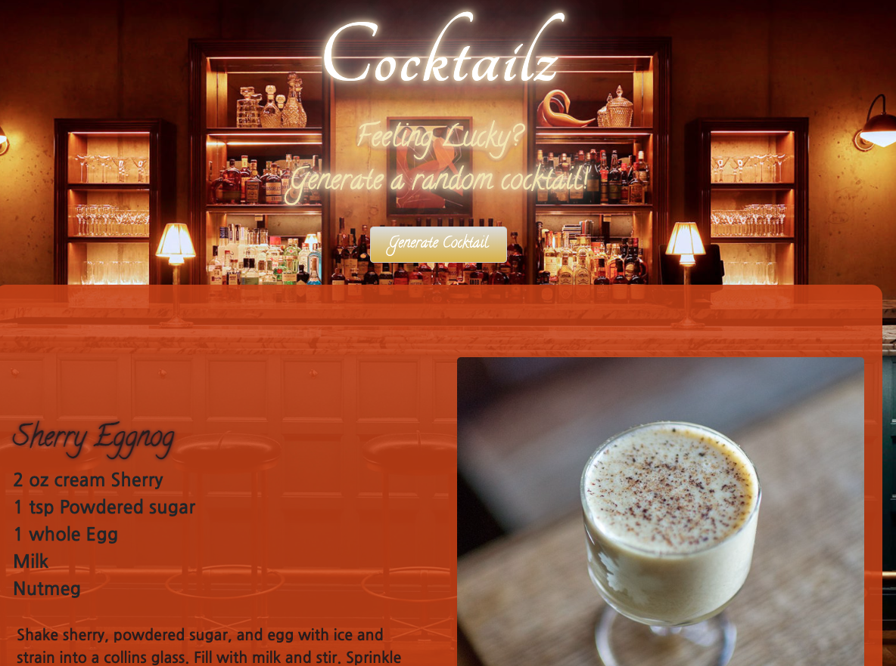

# Cocktailz
Cocktailz was created by Elizabeth Edelman, Owen Baker, Elena Cussler, and David Garcia.

## Description 
Have you ever wanted to impress your friends with new drinks, needed some drink ideas for an upcomming wedding? Our exciting new app, Cocktailz will do all the work for you. Cocktailz will let you generate a random cocktail, with ingredients and instructions on how to make said cocktail. Additionally, Cocktailz provides a list of nearby liquor stores in the city of Denver.

What did we learn?
During this project we learned how to use Github in a team enviornment, resolve merge conflicts, and debug in the terminal. The group was able to increase familiarity with Javascript, calling 3rd party API's and expanding our Bootstrap styling knowledge.

## Installation 
There is no special requirements to use this application. Simply click on the link, it will direct you to the page. 

## Usage 
Once the user lands on the application, the user must click on the on the generate cocktails button. This will generate a random cocktail, with ingredients and measurments. After the cocktail is generated, the user will be presented with a second button to locate nearby liquor stores in Denver CO. This will display the name and street adress of the bussiness.

## Deployed Page

https://lizedelman.github.io/bopsnbooze/

## Credits

Basic page styling: https://getbootstrap.com/

The Cocktails DB: https://www.thecocktaildb.com/

Virtual Earth: https://www.microsoft.com/en-us/maps

Background Image Source: https://punchdrink.com/articles/best-new-bars-america-spring-summer-2019/

## License 
Please refer to the license in the Github repository
